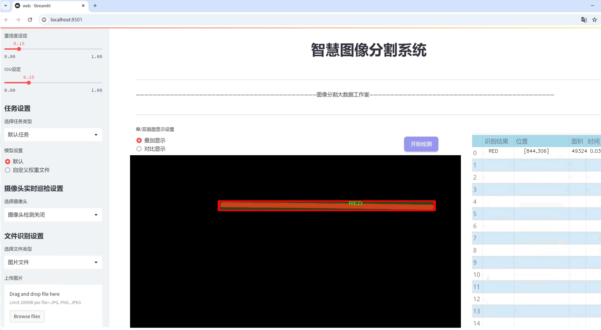
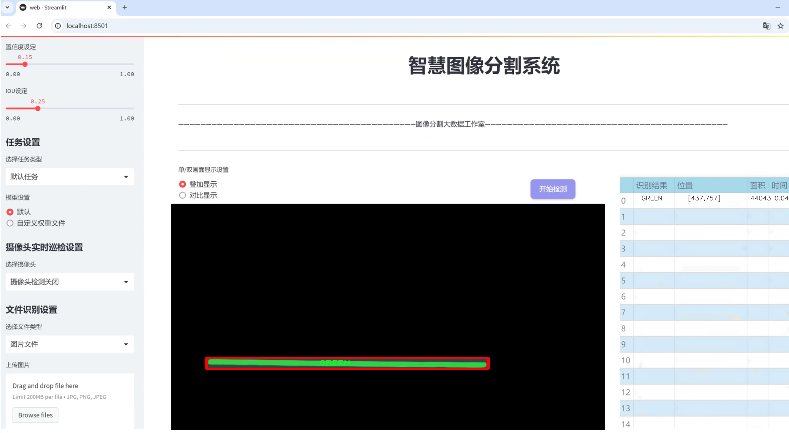
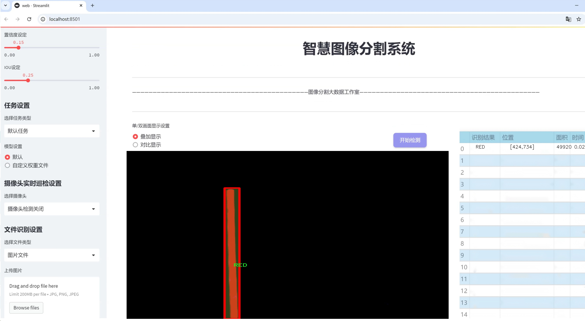
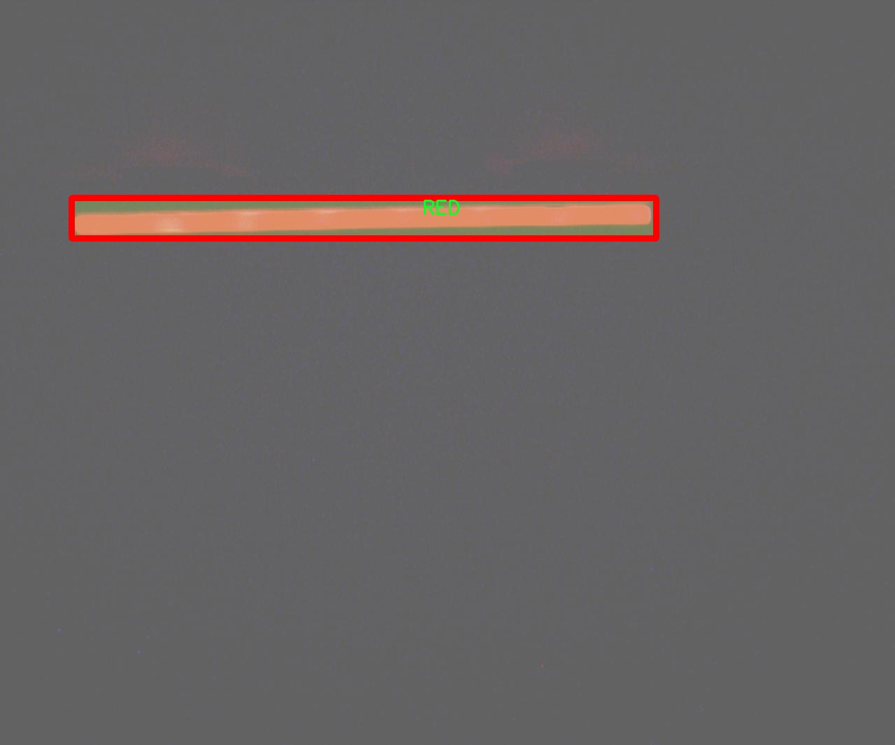
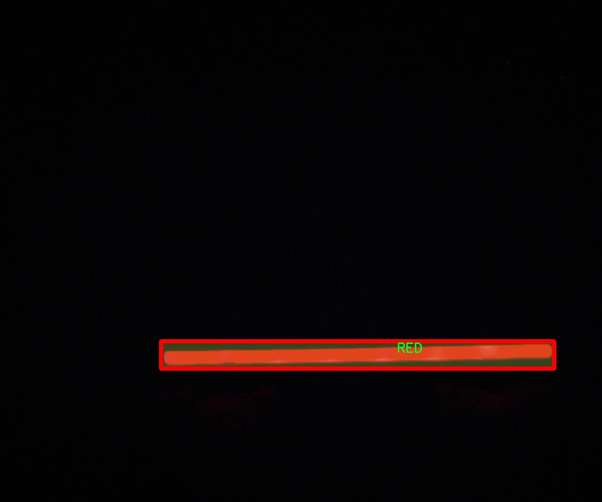
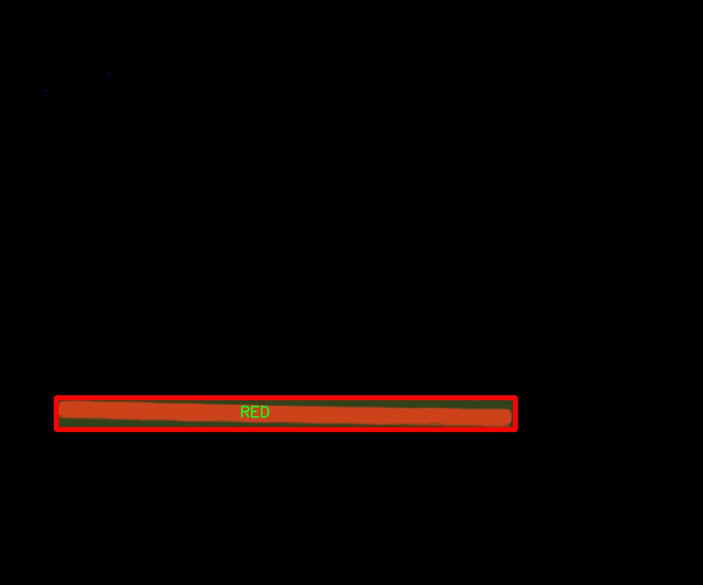
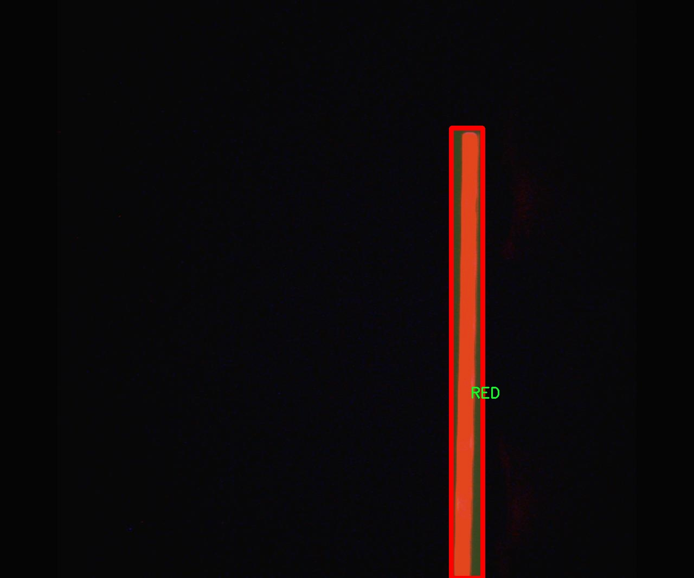

# LED灯具分割系统源码＆数据集分享
 [yolov8-seg-EfficientRepBiPAN＆yolov8-seg-dyhead等50+全套改进创新点发刊_一键训练教程_Web前端展示]

### 1.研究背景与意义

项目参考[ILSVRC ImageNet Large Scale Visual Recognition Challenge](https://gitee.com/YOLOv8_YOLOv11_Segmentation_Studio/projects)

项目来源[AAAI Global Al lnnovation Contest](https://kdocs.cn/l/cszuIiCKVNis)

研究背景与意义

随着智能家居和物联网技术的迅猛发展，LED灯具作为一种高效、环保的照明解决方案，逐渐成为现代生活中不可或缺的一部分。LED灯具的广泛应用不仅提升了人们的生活质量，也推动了照明行业的技术革新。然而，随着市场需求的增加，LED灯具的种类和规格日益繁多，如何高效、准确地对不同类型的LED灯具进行识别和分割，成为了一个亟待解决的问题。传统的图像处理方法在面对复杂的环境和多样的灯具类型时，往往难以达到理想的效果。因此，基于深度学习的图像分割技术，尤其是改进的YOLOv8模型，成为了研究的重点。

YOLO（You Only Look Once）系列模型以其高效的实时检测能力和较高的准确率，在目标检测和分割领域取得了显著的成果。YOLOv8作为该系列的最新版本，进一步优化了模型结构和算法性能，能够在更复杂的场景中实现快速而准确的目标分割。针对LED灯具的特性，研究基于改进YOLOv8的LED灯具分割系统，不仅可以提升灯具识别的精度，还能为后续的智能控制和管理提供重要的数据支持。

本研究所使用的数据集“Mau4800”包含2000张图像，涵盖了7种不同类别的LED灯具，包括蓝色、绿色、红色、红外LED、近红外、NG和NG 1等。这些类别的多样性为模型的训练提供了丰富的样本，能够有效提升模型的泛化能力。通过对这些图像进行实例分割，研究将能够深入分析不同类型LED灯具的特征和分布，进而为智能照明系统的设计和优化提供理论依据。

此外，LED灯具的精确分割不仅在工业自动化和智能家居领域具有重要意义，也为后续的计算机视觉应用提供了基础。通过对LED灯具的有效识别和分割，能够实现更智能的环境感知与交互，为用户提供更加个性化的照明体验。例如，在智能家居系统中，能够根据用户的需求自动调节灯光的颜色和亮度，提升居住环境的舒适度和美观性。

综上所述，基于改进YOLOv8的LED灯具分割系统的研究，不仅具有重要的学术价值，也为实际应用提供了广阔的前景。通过深入探讨LED灯具的分割技术，研究将为智能照明的发展奠定坚实的基础，推动相关领域的技术进步与创新。因此，本研究的开展具有重要的理论意义和实际应用价值，为未来的智能照明系统和相关技术的发展提供了新的思路和方向。

### 2.图片演示







##### 注意：由于此博客编辑较早，上面“2.图片演示”和“3.视频演示”展示的系统图片或者视频可能为老版本，新版本在老版本的基础上升级如下：（实际效果以升级的新版本为准）

  （1）适配了YOLOV8的“目标检测”模型和“实例分割”模型，通过加载相应的权重（.pt）文件即可自适应加载模型。

  （2）支持“图片识别”、“视频识别”、“摄像头实时识别”三种识别模式。

  （3）支持“图片识别”、“视频识别”、“摄像头实时识别”三种识别结果保存导出，解决手动导出（容易卡顿出现爆内存）存在的问题，识别完自动保存结果并导出到tempDir中。

  （4）支持Web前端系统中的标题、背景图等自定义修改，后面提供修改教程。

  另外本项目提供训练的数据集和训练教程,暂不提供权重文件（best.pt）,需要您按照教程进行训练后实现图片演示和Web前端界面演示的效果。

### 3.视频演示

[3.1 视频演示](https://www.bilibili.com/video/BV1uu1CYdEUd/)

### 4.数据集信息展示

##### 4.1 本项目数据集详细数据（类别数＆类别名）

nc: 12
names: ['BAR NG', 'BAR NG COLOR', 'BLUE', 'GREEN', 'LED IR', 'LED IR MIDDLE', 'POWER BLUE LED', 'POWER LED NG', 'POWER RED LED', 'POWER WHITE LED', 'RED', 'WHITE']


##### 4.2 本项目数据集信息介绍

数据集信息展示

在本研究中，我们采用了名为“MAU4800”的数据集，以支持改进YOLOv8-seg的LED灯具分割系统的训练与验证。该数据集专门设计用于处理LED灯具的图像分割任务，具有丰富的多样性和高质量的标注信息，为深度学习模型的训练提供了坚实的基础。MAU4800数据集包含12个类别，涵盖了不同类型的LED灯具及其颜色变体，具体类别包括：BAR NG、BAR NG COLOR、BLUE、GREEN、LED IR、LED IR MIDDLE、POWER BLUE LED、POWER LED NG、POWER RED LED、POWER WHITE LED、RED和WHITE。这些类别的选择不仅考虑了LED灯具的功能性，还涵盖了其在不同应用场景中的色彩表现，确保模型能够有效识别和分割多种类型的LED灯具。

在数据集的构建过程中，MAU4800注重图像的多样性和代表性，包含了不同环境下拍摄的LED灯具图像，如室内、室外、不同光照条件和背景环境。这种多样性使得训练出的模型能够在实际应用中具备更强的鲁棒性和适应性。此外，数据集中的每一张图像都经过精确的标注，确保每个类别的灯具在图像中都能被准确地识别和分割。这种高质量的标注不仅提升了模型的训练效果，也为后续的评估和测试提供了可靠的依据。

MAU4800数据集的设计理念是为了解决LED灯具分割任务中的一些关键挑战，如不同颜色和形状的灯具在图像中的混淆、复杂背景对分割效果的影响等。通过引入多种颜色和类型的LED灯具，数据集能够有效地模拟真实场景中的复杂性，从而提升YOLOv8-seg模型在实际应用中的表现。特别是在处理色彩丰富的LED灯具时，模型需要具备较强的色彩识别能力，而MAU4800数据集正是通过丰富的类别设置来满足这一需求。

在数据集的使用过程中，我们将对每个类别进行详细的分析和评估，以确保模型在各个类别上的表现均衡。通过不断迭代和优化训练过程，我们期望能够提升模型在LED灯具分割任务中的准确性和效率。最终，我们希望通过MAU4800数据集的应用，推动LED灯具图像分割技术的发展，为相关领域的应用提供更为先进的解决方案。

综上所述，MAU4800数据集不仅为改进YOLOv8-seg的LED灯具分割系统提供了丰富的训练数据，也为后续的研究和应用奠定了坚实的基础。通过对该数据集的深入分析和有效利用，我们期待在LED灯具分割领域取得显著的进展。










### 5.全套项目环境部署视频教程（零基础手把手教学）

[5.1 环境部署教程链接（零基础手把手教学）](https://www.bilibili.com/video/BV1jG4Ve4E9t/?vd_source=bc9aec86d164b67a7004b996143742dc)


[5.2 安装Python虚拟环境创建和依赖库安装视频教程链接（零基础手把手教学）](https://www.bilibili.com/video/BV1nA4VeYEze/?vd_source=bc9aec86d164b67a7004b996143742dc)

### 6.手把手YOLOV8-seg训练视频教程（零基础小白有手就能学会）

[6.1 手把手YOLOV8-seg训练视频教程（零基础小白有手就能学会）](https://www.bilibili.com/video/BV1cA4VeYETe/?vd_source=bc9aec86d164b67a7004b996143742dc)


按照上面的训练视频教程链接加载项目提供的数据集，运行train.py即可开始训练



     Epoch   gpu_mem       box       obj       cls    labels  img_size
     1/200     0G   0.01576   0.01955  0.007536        22      1280: 100%|██████████| 849/849 [14:42<00:00,  1.04s/it]
               Class     Images     Labels          P          R     mAP@.5 mAP@.5:.95: 100%|██████████| 213/213 [01:14<00:00,  2.87it/s]
                 all       3395      17314      0.994      0.957      0.0957      0.0843

     Epoch   gpu_mem       box       obj       cls    labels  img_size
     2/200     0G   0.01578   0.01923  0.007006        22      1280: 100%|██████████| 849/849 [14:44<00:00,  1.04s/it]
               Class     Images     Labels          P          R     mAP@.5 mAP@.5:.95: 100%|██████████| 213/213 [01:12<00:00,  2.95it/s]
                 all       3395      17314      0.996      0.956      0.0957      0.0845

     Epoch   gpu_mem       box       obj       cls    labels  img_size
     3/200     0G   0.01561    0.0191  0.006895        27      1280: 100%|██████████| 849/849 [10:56<00:00,  1.29it/s]
               Class     Images     Labels          P          R     mAP@.5 mAP@.5:.95: 100%|███████   | 187/213 [00:52<00:00,  4.04it/s]
                 all       3395      17314      0.996      0.957      0.0957      0.0845


### 7.50+种全套YOLOV8-seg创新点代码加载调参视频教程（一键加载写好的改进模型的配置文件）

[7.1 50+种全套YOLOV8-seg创新点代码加载调参视频教程（一键加载写好的改进模型的配置文件）](https://www.bilibili.com/video/BV1Hw4VePEXv/?vd_source=bc9aec86d164b67a7004b996143742dc)

### 8.YOLOV8-seg图像分割算法原理

原始YOLOV8-seg算法原理

YOLOv8-seg算法作为YOLO系列的最新版本，结合了目标检测与语义分割的优点，展现出卓越的性能和灵活性。其设计理念不仅关注于提高目标检测的精度和速度，还将语义分割的特性融入其中，使得该算法能够在复杂场景中有效地进行物体识别和边界精确划分。YOLOv8-seg的核心在于其独特的网络结构与优化策略，这些创新使得算法在处理多样化的视觉任务时表现出色。

首先，YOLOv8-seg算法的主干网络依然采用了跨级结构（Cross Stage Partial, CSP）的设计思想，旨在提升特征提取的效率和准确性。与前代YOLOv5相比，YOLOv8-seg对C3模块进行了优化，采用了更轻量的C2f模块，这一变化不仅减小了模型的计算复杂度，还提高了特征流动的灵活性。C2f模块通过在不同层次之间进行特征融合，保留了丰富的上下文信息，从而使得网络在处理细粒度特征时更加敏感。

在特征提取过程中，YOLOv8-seg引入了空间金字塔池化（SPPF）模块，该模块通过多尺度池化操作，有效地增强了网络对不同尺寸目标的感知能力。通过对特征图进行不同内核尺寸的池化，SPPF能够捕捉到多层次的语义信息，进而提升了目标检测和分割的整体性能。此外，YOLOv8-seg在Neck部分采用了路径聚合网络（PAN）结构，结合了特征金字塔的优势，进一步促进了不同尺度特征的融合。这种设计使得网络能够更好地处理复杂场景中的目标，尤其是在小目标和大目标共存的情况下。

YOLOv8-seg的输出端采用了解耦头（Decoupled Head）结构，这一创新的设计使得分类和回归任务得以分离，从而加速了模型的收敛速度。解耦头结构通过对正负样本的匹配进行加权，优化了损失计算过程。分类损失采用了二元交叉熵（BCE）损失，而回归损失则使用了分布焦点损失（DFL）和完整交并比（CIoU）损失，这些损失函数的选择使得YOLOv8-seg在目标定位和分类方面表现得更加精准。

值得注意的是，YOLOv8-seg在处理复杂背景和小目标时仍然面临一定的挑战。为了解决这些问题，YOLOv8-seg引入了新的样本匹配策略，结合了数据平均保真度损失和完美交并比损失，这一策略显著提升了模型在复杂环境下的鲁棒性和准确性。通过对样本的精细匹配，YOLOv8-seg能够更好地应对背景噪声和小目标的遮挡问题，从而提高检测的精度。

此外，YOLOv8-seg在算法的整体架构上进行了轻量化设计，旨在降低计算资源的消耗。这一目标的实现不仅依赖于高效的特征提取网络，还结合了注意力机制，使得网络能够自适应地关注重要特征，抑制冗余信息的干扰。通过这种方式，YOLOv8-seg在保证高效性的同时，进一步提升了目标检测和分割的准确性。

在数据处理方面，YOLOv8-seg采用了多种数据增强技术，如Mosaic增强、自适应图片缩放和灰度填充等。这些技术的应用不仅丰富了训练数据的多样性，还提高了模型的泛化能力，使得YOLOv8-seg在不同场景下均能保持良好的性能。通过对输入数据的精细处理，YOLOv8-seg能够有效地应对各种复杂环境下的目标检测与分割任务。

综上所述，YOLOv8-seg算法通过一系列创新的设计与优化策略，成功地将目标检测与语义分割相结合，展现出卓越的性能。其轻量化的特征提取网络、灵活的解耦头结构以及高效的损失计算策略，使得YOLOv8-seg在处理复杂场景时能够保持高精度和高效率。随着YOLOv8-seg的不断发展与应用，其在实际场景中的潜力将进一步得到挖掘，为计算机视觉领域带来更多的可能性。


### 9.系统功能展示（检测对象为举例，实际内容以本项目数据集为准）

图9.1.系统支持检测结果表格显示

  图9.2.系统支持置信度和IOU阈值手动调节

  图9.3.系统支持自定义加载权重文件best.pt(需要你通过步骤5中训练获得)

  图9.4.系统支持摄像头实时识别

  图9.5.系统支持图片识别

  图9.6.系统支持视频识别

  图9.7.系统支持识别结果文件自动保存

  图9.8.系统支持Excel导出检测结果数据


### 10.50+种全套YOLOV8-seg创新点原理讲解（非科班也可以轻松写刊发刊，V11版本正在科研待更新）

#### 10.1 由于篇幅限制，每个创新点的具体原理讲解就不一一展开，具体见下列网址中的创新点对应子项目的技术原理博客网址【Blog】：


[10.1 50+种全套YOLOV8-seg创新点原理讲解链接](https://gitee.com/qunmasj/good)

#### 10.2 部分改进模块原理讲解(完整的改进原理见上图和技术博客链接)
### YOLOv8简介
Yolov8主要借鉴了Yolov5、Yolov6、YoloX等模型的设计优点，其本身创新点不多，偏重在工程实践上，具体创新如下:
·提供了一个全新的SOTA模型（包括P5 640和P6 1280分辨率的目标检测网络和基于YOLACT的实例分割模型)。并且，基于缩放系数提供了N/S/M/IL/X不同尺度的模型，以满足不同部署平台和应用场景的需求。
●Backbone:同样借鉴了CSP模块思想，不过将Yolov5中的C3模块替换成了C2f模块，实现了进一步轻量化，同时沿用Yolov5中的SPPF模块，并对不同尺度的模型进行精心微调，不再是无脑式—套参数用于所有模型，大幅提升了模型性能。
●Neck:继续使用PAN的思想，但是通过对比YOLOv5与YOLOv8的结构图可以看到，YOLOv8移除了1*1降采样层。
●Head部分相比YOLOv5改动较大，Yolov8换成了目前主流的解耦头结构(Decoupled-Head)，将分类和检测头分离，同时也从Anchor-Based换成了Anchor-Free。
●Loss计算:使用VFLLoss作为分类损失(实际训练中使用BCE Loss);使用DFLLoss+ClOU Loss作为回归损失。
●标签分配: Yolov8抛弃了以往的loU分配或者单边比例的分配方式，而是采用Task-Aligned Assigner正负样本分配策略。
#### Yolov8网络结构
Yolov8模型网络结构图如下图所示。


#### Backbone
Yolov8的Backbone同样借鉴了CSPDarkNet结构网络结构，与Yolov5最大区别是，Yolov8使用C2f模块代替C3模块。具体改进如下:
·第一个卷积层的Kernel size从6×6改为3x3。
·所有的C3模块改为C2f模块，如下图所示，多了更多的跳层连接和额外Split操作。。Block数由C3模块3-6-9-3改为C2f模块的3-6-6-3。

### 上下文引导网络（CGNet）简介


高准确率的模型（蓝点），由图像分类网络转化而来且参数量大，因此大多不适于移动设备。
低分辨率的小模型（红点），遵循分类网络的设计方式，忽略了分割特性，故而效果不好。
#### CGNet的设计：
为了提升准确率，用cgnet探索语义分割的固有属性。对于准确率的提升，因为语义分割是像素级分类和目标定位，所以空间依赖性和上下文信息发挥了重要作用。因此，设计cg模块，用于建模空间依赖性和语义上下文信息。
- 1、cg模块学习局部特征和周围特征形成联合特征
- 2、通过逐通道重新加权（强调有用信息，压缩无用信息），用全局特征改善联合特征
- 3、在全阶段应用cg模块，以便从语义层和空间层捕捉信息。
为了降低参数量：1、深层窄网络，尽可能节约内存 2、用通道卷积


之前的网络根据框架可分三类：
- 1、FCN-shape的模型，遵循分类网络的设计，忽略了上下文信息 ESPNet、ENet、fcn
- 2、FCN-CM模型，在编码阶段后用上下文模块捕捉语义级信息 DPC、DenseASPP、DFN、PSPNet
- 3、（our）在整个阶段捕捉上下文特征
- 4、主流分割网络的下采样为五次，学习了很多关于物体的抽象特征，丢失了很多有鉴别性的空间信息，导致分割边界过于平滑，（our）仅采用三次下采样，利于保存空间信息


#### cg模块

Cg模块：
思路：人类视觉系统依赖上下文信息理解场景。
如图3,a， 如若仅关注黄色框框，很难分辨，也就是说，仅关注局部特征不容易正确识别目标的类别。 然后，如果加入了目标周围的特征，即图3,b，就很容易识别正确，所以周围特征对于语义分割是很有帮助的。在此基础上，如果进一步用整个场景的特征加以辅助，将会有更高的程度去争正确分类黄色框框的物体，如图3,c所示。 故，周围上下文和全局上下文对于提升分割精度都是有帮助的。


实现：基于此，提出cg模块，利用局部特征，周围上下文以及全局上下文。如图3,d所示。该模块共包含两个阶段。

第一步，floc( ) 局部和 fsur( )周围函数分别学习对应特征。floc( )用3x3卷积从周围8个点提取特征，对应于黄色框框；同时fsur( )用感受野更大的3x3带孔卷积学习周围上下文，对应红色框框。然后fjoi( )是指将前两路特征concat之后经BN，PReLU。此一部分是cg模块的第一步。
对于模块的第二步，fglo( )用于提取全局特征，改善联合特征。受SENet启发，全局上下文被认为是一个加权向量，用于逐通道微调联合特征，以强调有用元素、压缩无用元素。在本论文中，fglo( )用GAP产生聚合上下文特征，然后用多层感知机进一步提取全局上下文。最后，使用一个尺度层对联合特征重新加权用提取的全局上下文。
残差连接有利于学习更复杂的特征以及便于训练时梯度反向传播。两个拟设计方案，LRL局部残差连接和GRL全局残差连接，实验证明（消融实验），GRL效果更好

#### CGNet网络


原则：深、瘦（deep and thin）以节省内存。层数少，通道数少，三个下采样。

Stage1，三个标准卷积层，分辨率变成原来的1/2

Stage2和stage3，分别堆叠M和N个cg模块。该两个阶段，第一层的输入是前一阶段第一个和最后一个block的结合（how结合）利于特征重用和特征传播。

将输入图像下采样到1/4和1/8分别输入到第2和3阶段。

最后，用1x1卷积层进行分割预测。

为进一步降低参数量，局部和周围特征提取器采用了逐通道卷积。之前有的工作在逐通道卷积后采用1x1卷积用以改善通道间的信息流动，本文消融实验显示效果不好，分析：因为cg模块中提取的局部和全局特征需要保持通道独立性，所以本论文不使用1*1卷积。


### 11.项目核心源码讲解（再也不用担心看不懂代码逻辑）

#### 11.1 ultralytics\models\utils\loss.py

以下是对给定代码的核心部分进行提炼和详细注释的结果：

```python
import torch
import torch.nn as nn
import torch.nn.functional as F
from ultralytics.utils.loss import FocalLoss, VarifocalLoss
from ultralytics.utils.metrics import bbox_iou
from .ops import HungarianMatcher

class DETRLoss(nn.Module):
    """
    DETR (DEtection TRansformer) 损失类。该类计算并返回DETR目标检测模型的不同损失组件。
    计算分类损失、边界框损失、GIoU损失，并可选择性地计算辅助损失。
    """

    def __init__(self, nc=80, loss_gain=None, aux_loss=True, use_fl=True, use_vfl=False, use_uni_match=False, uni_match_ind=0):
        """
        初始化DETR损失函数。

        参数:
            nc (int): 类别数量。
            loss_gain (dict): 各损失组件的系数。
            aux_loss (bool): 是否计算辅助损失。
            use_fl (bool): 是否使用FocalLoss。
            use_vfl (bool): 是否使用VarifocalLoss。
            use_uni_match (bool): 是否使用固定层为辅助分支分配标签。
            uni_match_ind (int): 如果`use_uni_match`为True，使用的固定层索引。
        """
        super().__init__()

        # 初始化损失系数
        if loss_gain is None:
            loss_gain = {'class': 1, 'bbox': 5, 'giou': 2, 'no_object': 0.1}
        self.nc = nc  # 类别数量
        self.matcher = HungarianMatcher(cost_gain={'class': 2, 'bbox': 5, 'giou': 2})  # 匹配器
        self.loss_gain = loss_gain  # 损失系数
        self.aux_loss = aux_loss  # 是否计算辅助损失
        self.fl = FocalLoss() if use_fl else None  # Focal Loss对象
        self.vfl = VarifocalLoss() if use_vfl else None  # Varifocal Loss对象
        self.use_uni_match = use_uni_match  # 是否使用统一匹配
        self.uni_match_ind = uni_match_ind  # 统一匹配索引
        self.device = None  # 设备

    def _get_loss_class(self, pred_scores, targets, gt_scores, num_gts, postfix=''):
        """计算分类损失。"""
        name_class = f'loss_class{postfix}'  # 分类损失名称
        bs, nq = pred_scores.shape[:2]  # 获取批次大小和查询数量
        one_hot = torch.zeros((bs, nq, self.nc + 1), dtype=torch.int64, device=targets.device)  # 初始化one-hot编码
        one_hot.scatter_(2, targets.unsqueeze(-1), 1)  # 将目标转换为one-hot编码
        one_hot = one_hot[..., :-1]  # 去掉最后一类（背景类）
        gt_scores = gt_scores.view(bs, nq, 1) * one_hot  # 计算真实分数

        # 计算分类损失
        if self.fl:
            if num_gts and self.vfl:
                loss_cls = self.vfl(pred_scores, gt_scores, one_hot)  # 使用VarifocalLoss
            else:
                loss_cls = self.fl(pred_scores, one_hot.float())  # 使用FocalLoss
            loss_cls /= max(num_gts, 1) / nq  # 标准化损失
        else:
            loss_cls = nn.BCEWithLogitsLoss(reduction='none')(pred_scores, gt_scores).mean(1).sum()  # 使用BCE损失

        return {name_class: loss_cls.squeeze() * self.loss_gain['class']}  # 返回分类损失

    def _get_loss_bbox(self, pred_bboxes, gt_bboxes, postfix=''):
        """计算边界框损失和GIoU损失。"""
        name_bbox = f'loss_bbox{postfix}'  # 边界框损失名称
        name_giou = f'loss_giou{postfix}'  # GIoU损失名称

        loss = {}
        if len(gt_bboxes) == 0:  # 如果没有真实边界框
            loss[name_bbox] = torch.tensor(0., device=self.device)
            loss[name_giou] = torch.tensor(0., device=self.device)
            return loss

        # 计算L1损失
        loss[name_bbox] = self.loss_gain['bbox'] * F.l1_loss(pred_bboxes, gt_bboxes, reduction='sum') / len(gt_bboxes)
        # 计算GIoU损失
        loss[name_giou] = 1.0 - bbox_iou(pred_bboxes, gt_bboxes, xywh=True, GIoU=True)
        loss[name_giou] = loss[name_giou].sum() / len(gt_bboxes)
        loss[name_giou] = self.loss_gain['giou'] * loss[name_giou]
        return {k: v.squeeze() for k, v in loss.items()}  # 返回损失

    def _get_loss(self, pred_bboxes, pred_scores, gt_bboxes, gt_cls, gt_groups, masks=None, gt_mask=None, postfix='', match_indices=None):
        """获取损失。"""
        if match_indices is None:
            match_indices = self.matcher(pred_bboxes, pred_scores, gt_bboxes, gt_cls, gt_groups, masks=masks, gt_mask=gt_mask)

        idx, gt_idx = self._get_index(match_indices)  # 获取索引
        pred_bboxes, gt_bboxes = pred_bboxes[idx], gt_bboxes[gt_idx]  # 获取匹配的边界框

        bs, nq = pred_scores.shape[:2]  # 获取批次大小和查询数量
        targets = torch.full((bs, nq), self.nc, device=pred_scores.device, dtype=gt_cls.dtype)  # 初始化目标
        targets[idx] = gt_cls[gt_idx]  # 更新目标

        gt_scores = torch.zeros([bs, nq], device=pred_scores.device)  # 初始化真实分数
        if len(gt_bboxes):
            gt_scores[idx] = bbox_iou(pred_bboxes.detach(), gt_bboxes, xywh=True).squeeze(-1)  # 计算真实分数

        loss = {}
        loss.update(self._get_loss_class(pred_scores, targets, gt_scores, len(gt_bboxes), postfix))  # 计算分类损失
        loss.update(self._get_loss_bbox(pred_bboxes, gt_bboxes, postfix))  # 计算边界框损失
        return loss  # 返回总损失

    def forward(self, pred_bboxes, pred_scores, batch, postfix='', **kwargs):
        """
        前向传播，计算损失。

        参数:
            pred_bboxes (torch.Tensor): 预测的边界框。
            pred_scores (torch.Tensor): 预测的分数。
            batch (dict): 包含真实标签的字典。
            postfix (str): 损失名称后缀。
        """
        self.device = pred_bboxes.device  # 设置设备
        match_indices = kwargs.get('match_indices', None)  # 获取匹配索引
        gt_cls, gt_bboxes, gt_groups = batch['cls'], batch['bboxes'], batch['gt_groups']  # 获取真实标签

        total_loss = self._get_loss(pred_bboxes[-1], pred_scores[-1], gt_bboxes, gt_cls, gt_groups, postfix=postfix, match_indices=match_indices)  # 计算总损失

        if self.aux_loss:  # 如果计算辅助损失
            total_loss.update(self._get_loss_aux(pred_bboxes[:-1], pred_scores[:-1], gt_bboxes, gt_cls, gt_groups, match_indices, postfix))

        return total_loss  # 返回总损失
```

### 代码核心部分分析：
1. **类的定义**：`DETRLoss`类是一个PyTorch模块，专门用于计算DETR模型的损失，包括分类损失、边界框损失和GIoU损失。
2. **初始化方法**：在`__init__`方法中，初始化了损失的各个组件，包括类别数量、损失系数、是否使用FocalLoss和VarifocalLoss等。
3. **损失计算方法**：
   - `_get_loss_class`：计算分类损失，使用one-hot编码和损失函数。
   - `_get_loss_bbox`：计算边界框损失和GIoU损失。
   - `_get_loss`：整合分类损失和边界框损失的计算。
4. **前向传播**：`forward`方法用于计算给定输入的总损失，支持计算辅助损失。

### 备注：
- 注释中解释了每个方法的功能和参数，便于理解代码的逻辑和用途。
- 代码中一些未使用的部分（如mask相关的损失计算）被注释掉，保持了代码的简洁性。

这个文件是Ultralytics YOLO模型中的一个损失函数模块，主要用于计算DETR（DEtection TRansformer）模型的损失。该模块的核心是`DETRLoss`类，它继承自PyTorch的`nn.Module`，并实现了多种损失计算方法，包括分类损失、边界框损失和GIoU（广义交并比）损失。

在`DETRLoss`类的构造函数中，初始化了一些参数，包括类别数量、损失系数、是否使用辅助损失、是否使用Focal Loss和Varifocal Loss等。`HungarianMatcher`用于计算匹配成本和索引，以便在计算损失时能够将预测的边界框与真实的边界框进行匹配。

`_get_loss_class`方法计算分类损失。它首先创建一个one-hot编码的目标张量，然后根据预测分数和真实分数计算损失。如果启用了Focal Loss或Varifocal Loss，则使用相应的损失函数；否则，使用二元交叉熵损失。

`_get_loss_bbox`方法计算边界框损失和GIoU损失。它首先检查是否有真实边界框，如果没有，则返回零损失。否则，计算L1损失和GIoU损失，并根据预设的损失系数进行加权。

`_get_loss_aux`方法用于计算辅助损失，适用于多层解码器的情况。它通过遍历每一层的预测结果，调用`_get_loss`方法来计算损失，并将结果累加。

`_get_loss`方法是损失计算的核心，它首先通过匹配索引将预测的边界框和真实的边界框进行匹配，然后计算分类损失和边界框损失。

`forward`方法是模型的前向传播函数，接收预测的边界框和分数、批次数据等参数，最终返回总损失。如果启用了辅助损失，还会计算每一层的辅助损失并合并到总损失中。

`RTDETRDetectionLoss`类是`DETRLoss`的扩展，专门用于RT-DETR模型的损失计算。它在计算标准损失的基础上，还支持计算去噪训练损失。`forward`方法中会检查是否提供了去噪的元数据，如果有，则计算去噪损失并将其合并到总损失中。

总的来说，这个文件实现了DETR模型的损失计算逻辑，支持多种损失函数和辅助损失的计算，为模型的训练提供了必要的损失反馈。

#### 11.2 ui.py

```python
import sys
import subprocess

def run_script(script_path):
    """
    使用当前 Python 环境运行指定的脚本。

    Args:
        script_path (str): 要运行的脚本路径

    Returns:
        None
    """
    # 获取当前 Python 解释器的路径
    python_path = sys.executable

    # 构建运行命令，使用 streamlit 运行指定的脚本
    command = f'"{python_path}" -m streamlit run "{script_path}"'

    # 执行命令并等待其完成
    result = subprocess.run(command, shell=True)
    
    # 检查命令执行结果，如果返回码不为0，则表示出错
    if result.returncode != 0:
        print("脚本运行出错。")


# 实例化并运行应用
if __name__ == "__main__":
    # 指定要运行的脚本路径
    script_path = "web.py"  # 这里可以直接指定脚本名，假设在当前目录下

    # 调用函数运行脚本
    run_script(script_path)
```

### 代码注释说明：
1. **导入模块**：
   - `sys`：用于获取当前 Python 解释器的路径。
   - `subprocess`：用于执行外部命令。

2. **定义 `run_script` 函数**：
   - 该函数接收一个参数 `script_path`，表示要运行的 Python 脚本的路径。
   - 函数内部首先获取当前 Python 解释器的路径，然后构建一个命令字符串，用于运行 `streamlit` 应用。

3. **构建命令**：
   - 使用 `-m streamlit run` 命令来运行指定的脚本，确保在当前 Python 环境中执行。

4. **执行命令**：
   - 使用 `subprocess.run` 执行构建的命令，并等待其完成。
   - 检查命令的返回码，如果返回码不为0，表示脚本运行出错，并打印错误信息。

5. **主程序入口**：
   - 使用 `if __name__ == "__main__":` 确保只有在直接运行该脚本时才会执行下面的代码。
   - 指定要运行的脚本路径（这里假设为 `web.py`），然后调用 `run_script` 函数来执行该脚本。

这个程序文件名为 `ui.py`，其主要功能是通过当前的 Python 环境运行一个指定的脚本，具体是使用 Streamlit 框架来启动一个 Web 应用。

程序首先导入了必要的模块，包括 `sys`、`os` 和 `subprocess`，其中 `sys` 用于访问与 Python 解释器相关的变量和函数，`os` 用于与操作系统交互，而 `subprocess` 则用于执行外部命令。

接着，程序从 `QtFusion.path` 模块中导入了 `abs_path` 函数，这个函数的作用是获取给定路径的绝对路径。

在 `run_script` 函数中，程序接收一个参数 `script_path`，这是要运行的脚本的路径。函数内部首先获取当前 Python 解释器的路径，存储在 `python_path` 变量中。然后，构建一个命令字符串 `command`，这个命令会使用 Streamlit 来运行指定的脚本。具体来说，命令格式为 `"{python_path}" -m streamlit run "{script_path}"`，其中 `{python_path}` 和 `{script_path}` 会被实际的路径替换。

接下来，程序使用 `subprocess.run` 方法执行这个命令，`shell=True` 参数表示在 shell 中执行命令。执行后，程序检查返回的结果，如果返回码不为 0，说明脚本运行出错，此时会打印出“脚本运行出错。”的提示信息。

最后，在 `if __name__ == "__main__":` 语句块中，程序指定了要运行的脚本路径，这里使用 `abs_path("web.py")` 来获取 `web.py` 的绝对路径。然后调用 `run_script` 函数来执行这个脚本。

总的来说，这个程序的主要目的是为用户提供一个简单的接口，以便在当前 Python 环境中运行一个基于 Streamlit 的 Web 应用。

#### 11.3 demo_test_camera.py

以下是代码中最核心的部分，并附上详细的中文注释：

```python
import cv2
import numpy as np
from PIL import ImageFont, ImageDraw, Image
from hashlib import md5
from model import Web_Detector
from chinese_name_list import Label_list

def generate_color_based_on_name(name):
    # 使用哈希函数生成稳定的颜色
    hash_object = md5(name.encode())  # 对名字进行MD5哈希
    hex_color = hash_object.hexdigest()[:6]  # 取前6位16进制数作为颜色
    r, g, b = int(hex_color[0:2], 16), int(hex_color[2:4], 16), int(hex_color[4:6], 16)  # 转换为RGB
    return (b, g, r)  # OpenCV 使用BGR格式

def draw_with_chinese(image, text, position, font_size=20, color=(255, 0, 0)):
    # 在图像上绘制中文文本
    image_pil = Image.fromarray(cv2.cvtColor(image, cv2.COLOR_BGR2RGB))  # 转换为PIL格式
    draw = ImageDraw.Draw(image_pil)  # 创建绘图对象
    font = ImageFont.truetype("simsun.ttc", font_size, encoding="unic")  # 加载中文字体
    draw.text(position, text, font=font, fill=color)  # 绘制文本
    return cv2.cvtColor(np.array(image_pil), cv2.COLOR_RGB2BGR)  # 转换回OpenCV格式

def draw_detections(image, info):
    # 在图像上绘制检测结果
    name, bbox = info['class_name'], info['bbox']  # 获取类别名称和边界框
    x1, y1, x2, y2 = bbox  # 解包边界框坐标
    cv2.rectangle(image, (x1, y1), (x2, y2), color=(0, 0, 255), thickness=3)  # 绘制边界框
    image = draw_with_chinese(image, name, (x1, y1 - 10), font_size=20)  # 绘制类别名称
    return image

def process_frame(model, image):
    # 处理每一帧图像
    pre_img = model.preprocess(image)  # 预处理图像
    pred = model.predict(pre_img)  # 进行预测
    det = pred[0]  # 获取检测结果

    if det is not None and len(det):
        det_info = model.postprocess(pred)  # 后处理，获取检测信息
        for info in det_info:
            image = draw_detections(image, info)  # 绘制检测结果
    return image

if __name__ == "__main__":
    model = Web_Detector()  # 初始化检测模型
    model.load_model("./weights/yolov8s-seg.pt")  # 加载模型权重

    # 摄像头实时处理
    cap = cv2.VideoCapture(0)  # 打开摄像头
    while cap.isOpened():
        ret, frame = cap.read()  # 读取摄像头帧
        if not ret:
            break
        processed_frame = process_frame(model, frame)  # 处理帧
        cv2.imshow('Camera Feed', processed_frame)  # 显示处理后的帧
        if cv2.waitKey(1) & 0xFF == ord('q'):  # 按'q'退出
            break
    cap.release()  # 释放摄像头
    cv2.destroyAllWindows()  # 关闭所有OpenCV窗口
```

### 代码核心部分说明：
1. **生成颜色**：`generate_color_based_on_name` 函数使用MD5哈希生成稳定的颜色，确保同一个名字总是对应同一种颜色。
2. **绘制中文文本**：`draw_with_chinese` 函数使用PIL库在图像上绘制中文文本，支持中文显示。
3. **绘制检测结果**：`draw_detections` 函数负责在图像上绘制检测到的物体的边界框和类别名称。
4. **处理每一帧**：`process_frame` 函数负责对每一帧图像进行预处理、预测和后处理，并绘制检测结果。
5. **实时摄像头处理**：在主程序中，打开摄像头并不断读取帧，处理后显示，直到用户按下'q'键退出。

这个程序文件 `demo_test_camera.py` 是一个用于实时目标检测和分割的示例代码，主要依赖于 OpenCV 和深度学习模型。程序的主要功能是通过摄像头捕捉视频流，并对每一帧进行处理，识别出图像中的目标，并在图像上绘制检测结果。

首先，程序导入了一些必要的库，包括 `random`、`cv2`（OpenCV）、`numpy`、`PIL`（用于处理图像的库）以及 `hashlib`（用于生成哈希值）。此外，还导入了自定义的 `Web_Detector` 模型和 `Label_list`，后者可能包含目标类别的名称。

程序中定义了几个辅助函数。`generate_color_based_on_name` 函数根据目标名称生成一个稳定的颜色，使用 MD5 哈希函数确保同一名称总是生成相同的颜色。`calculate_polygon_area` 函数计算给定点的多边形面积。`draw_with_chinese` 函数则用于在图像上绘制中文文本，使用指定的字体和颜色。

`adjust_parameter` 函数根据图像的大小调整参数，以便在不同分辨率下保持绘制的一致性。`draw_detections` 函数是核心部分，它负责在图像上绘制检测到的目标，包括边界框、类别名称、面积、周长、圆度和颜色值等信息。如果目标有掩膜，则还会填充掩膜区域并计算相关的几何特征。

`process_frame` 函数处理每一帧图像，首先对图像进行预处理，然后通过模型进行预测，最后对检测结果进行后处理，并调用 `draw_detections` 函数绘制检测结果。

在主程序部分，首先加载目标类别名称和深度学习模型。然后通过 OpenCV 打开摄像头，进入一个循环，持续读取摄像头的每一帧。如果成功读取到帧，则调用 `process_frame` 函数进行处理，并显示处理后的图像。如果按下 'q' 键，则退出循环，释放摄像头资源并关闭所有窗口。

整体来看，这个程序实现了一个简单的实时目标检测和分割的应用，能够在视频流中识别并标注目标，适合用于演示和测试计算机视觉模型的效果。

#### 11.4 ultralytics\models\yolo\segment\__init__.py

```python
# Ultralytics YOLO 🚀, AGPL-3.0 license

# 从当前模块导入SegmentationPredictor、SegmentationTrainer和SegmentationValidator类
from .predict import SegmentationPredictor
from .train import SegmentationTrainer
from .val import SegmentationValidator

# 定义模块的公开接口，指定可以被外部访问的类
__all__ = 'SegmentationPredictor', 'SegmentationTrainer', 'SegmentationValidator'
```

### 代码注释说明：
1. **导入模块**：
   - `from .predict import SegmentationPredictor`：从当前包的`predict`模块中导入`SegmentationPredictor`类，通常用于图像分割的预测功能。
   - `from .train import SegmentationTrainer`：从当前包的`train`模块中导入`SegmentationTrainer`类，通常用于训练图像分割模型。
   - `from .val import SegmentationValidator`：从当前包的`val`模块中导入`SegmentationValidator`类，通常用于验证图像分割模型的性能。

2. **定义公开接口**：
   - `__all__`是一个特殊变量，用于定义当使用`from module import *`时，哪些类或函数可以被导入。在这里，`SegmentationPredictor`、`SegmentationTrainer`和`SegmentationValidator`被指定为模块的公开接口。

这个程序文件是Ultralytics YOLO（一个用于目标检测和分割的深度学习框架）中的一个初始化文件，通常用于模块的组织和导入。文件名为`__init__.py`，它的主要作用是将当前目录标识为一个Python包，并定义该包的公共接口。

在这个文件中，首先有一个注释，指出这是Ultralytics YOLO的代码，并且使用的是AGPL-3.0许可证。接下来，文件从当前包中导入了三个类：`SegmentationPredictor`、`SegmentationTrainer`和`SegmentationValidator`。这些类分别用于图像分割的预测、训练和验证。

最后，`__all__`变量被定义为一个元组，包含了三个类的名称。这意味着当使用`from module import *`的方式导入这个包时，只会导入这三个类，而不会导入其他可能存在的模块或类。这是一种控制包的公共接口的方式，确保用户只访问到设计好的部分，从而避免直接接触到内部实现细节。

总的来说，这个文件是Ultralytics YOLO框架中与图像分割相关功能的入口，提供了清晰的模块结构和接口定义。

#### 11.5 ultralytics\nn\backbone\repvit.py

以下是经过简化和注释的核心代码部分：

```python
import torch
import torch.nn as nn
from timm.models.layers import SqueezeExcite

def _make_divisible(v, divisor, min_value=None):
    """
    确保所有层的通道数是可被8整除的
    :param v: 输入的通道数
    :param divisor: 需要整除的数
    :param min_value: 最小值
    :return: 调整后的通道数
    """
    if min_value is None:
        min_value = divisor
    new_v = max(min_value, int(v + divisor / 2) // divisor * divisor)
    if new_v < 0.9 * v:  # 确保向下取整不超过10%
        new_v += divisor
    return new_v

class Conv2d_BN(nn.Sequential):
    """
    包含卷积层和批归一化层的模块
    """
    def __init__(self, in_channels, out_channels, kernel_size=1, stride=1, padding=0, dilation=1, groups=1):
        super().__init__()
        # 添加卷积层
        self.add_module('conv', nn.Conv2d(in_channels, out_channels, kernel_size, stride, padding, dilation, groups, bias=False))
        # 添加批归一化层
        self.add_module('bn', nn.BatchNorm2d(out_channels))

    @torch.no_grad()
    def fuse_self(self):
        """
        融合卷积层和批归一化层为一个卷积层
        """
        conv, bn = self._modules.values()
        # 计算新的权重和偏置
        w = bn.weight / (bn.running_var + bn.eps)**0.5
        w = conv.weight * w[:, None, None, None]
        b = bn.bias - bn.running_mean * bn.weight / (bn.running_var + bn.eps)**0.5
        # 创建新的卷积层
        fused_conv = nn.Conv2d(w.size(1) * conv.groups, w.size(0), w.shape[2:], stride=conv.stride, padding=conv.padding, dilation=conv.dilation, groups=conv.groups)
        fused_conv.weight.data.copy_(w)
        fused_conv.bias.data.copy_(b)
        return fused_conv

class RepViTBlock(nn.Module):
    """
    RepViT模块，包含token混合和通道混合
    """
    def __init__(self, inp, hidden_dim, oup, kernel_size, stride, use_se, use_hs):
        super(RepViTBlock, self).__init__()
        self.identity = stride == 1 and inp == oup  # 判断是否为身份映射
        assert(hidden_dim == 2 * inp)  # 确保隐藏层维度是输入的两倍

        if stride == 2:
            # 如果步幅为2，构建token混合和通道混合
            self.token_mixer = nn.Sequential(
                Conv2d_BN(inp, inp, kernel_size, stride, (kernel_size - 1) // 2, groups=inp),
                SqueezeExcite(inp, 0.25) if use_se else nn.Identity(),
                Conv2d_BN(inp, oup, ks=1, stride=1, pad=0)
            )
            self.channel_mixer = nn.Sequential(
                Conv2d_BN(oup, 2 * oup, 1, 1, 0),
                nn.GELU() if use_hs else nn.Identity(),
                Conv2d_BN(2 * oup, oup, 1, 1, 0)
            )
        else:
            assert(self.identity)
            self.token_mixer = nn.Sequential(
                Conv2d_BN(inp, inp, 3, 1, 1, groups=inp),
                SqueezeExcite(inp, 0.25) if use_se else nn.Identity(),
            )
            self.channel_mixer = nn.Sequential(
                Conv2d_BN(inp, hidden_dim, 1, 1, 0),
                nn.GELU() if use_hs else nn.Identity(),
                Conv2d_BN(hidden_dim, oup, 1, 1, 0)
            )

    def forward(self, x):
        return self.channel_mixer(self.token_mixer(x))

class RepViT(nn.Module):
    """
    RepViT模型，包含多个RepViTBlock
    """
    def __init__(self, cfgs):
        super(RepViT, self).__init__()
        self.cfgs = cfgs  # 模型配置
        input_channel = self.cfgs[0][2]  # 输入通道数
        layers = [Conv2d_BN(3, input_channel // 2, 3, 2, 1), nn.GELU(),
                  Conv2d_BN(input_channel // 2, input_channel, 3, 2, 1)]  # 构建第一层

        for k, t, c, use_se, use_hs, s in self.cfgs:
            output_channel = _make_divisible(c, 8)  # 确保输出通道数可被8整除
            exp_size = _make_divisible(input_channel * t, 8)  # 确保扩展通道数可被8整除
            layers.append(RepViTBlock(input_channel, exp_size, output_channel, k, s, use_se, use_hs))
            input_channel = output_channel  # 更新输入通道数
        self.features = nn.ModuleList(layers)  # 将所有层放入ModuleList中

    def forward(self, x):
        for f in self.features:
            x = f(x)  # 逐层前向传播
        return x

def repvit_m2_3(weights=''):
    """
    构建RepViT模型的一个变体
    """
    cfgs = [
        # k, t, c, SE, HS, s 
        [3, 2, 80, 1, 0, 1],
        [3, 2, 80, 0, 0, 1],
        # 省略其他配置...
        [3, 2, 640, 0, 1, 2],
        [3, 2, 640, 1, 1, 1],
    ]
    model = RepViT(cfgs)  # 创建模型
    if weights:
        model.load_state_dict(torch.load(weights)['model'])  # 加载权重
    return model

if __name__ == '__main__':
    model = repvit_m2_3('repvit_m2_3_distill_450e.pth')  # 实例化模型
    inputs = torch.randn((1, 3, 640, 640))  # 创建输入
    res = model(inputs)  # 前向传播
    for i in res:
        print(i.size())  # 输出每层的尺寸
```

### 代码说明：
1. **_make_divisible**: 确保通道数是8的倍数，适用于模型结构的设计。
2. **Conv2d_BN**: 自定义的卷积层，包含卷积和批归一化，支持融合操作以减少计算量。
3. **RepViTBlock**: 代表性ViT模块，负责特征的混合和处理，支持不同的步幅和通道配置。
4. **RepViT**: 整个模型的实现，构建多个RepViTBlock并定义前向传播逻辑。
5. **repvit_m2_3**: 创建特定配置的RepViT模型并加载预训练权重。

这个程序文件实现了一个名为RepViT的深度学习模型，主要用于计算机视觉任务。代码中包含了多个类和函数，用于构建和操作模型的各个部分。

首先，文件导入了必要的库，包括PyTorch和NumPy，以及timm库中的SqueezeExcite层。接着，定义了一个名为`replace_batchnorm`的函数，该函数用于遍历网络中的所有子模块，并将BatchNorm2d层替换为Identity层，从而在模型推理时提高效率。

接下来，定义了一个名为`_make_divisible`的辅助函数，确保网络中所有层的通道数都是8的倍数，这在某些模型中是一个常见的约定，以便于优化和兼容性。

`Conv2d_BN`类是一个自定义的模块，包含一个卷积层和一个BatchNorm层，并提供了一个`fuse_self`方法，用于将卷积和BatchNorm层融合为一个卷积层，以减少计算量。

`Residual`类实现了残差连接的功能，允许在训练期间使用随机丢弃来增强模型的鲁棒性。它也有一个`fuse_self`方法，用于融合卷积层和BatchNorm层。

`RepVGGDW`类实现了一种特殊的卷积结构，结合了深度可分离卷积和残差连接。

`RepViTBlock`类是RepViT模型的基本构建块，负责处理输入特征图的通道和空间信息。它根据输入的参数构建不同的卷积和激活层，并根据需要使用SqueezeExcite模块。

`RepViT`类是整个模型的主体，接受一个配置列表来构建多个RepViTBlock，并通过前向传播方法处理输入数据。它还定义了一个`switch_to_deploy`方法，用于在推理阶段替换BatchNorm层。

`update_weight`函数用于更新模型的权重，确保新权重与模型结构匹配。

最后，定义了一系列函数（如`repvit_m0_9`、`repvit_m1_0`等），用于构建不同版本的RepViT模型，并可选择加载预训练权重。

在文件的最后部分，包含了一个示例代码，展示了如何实例化一个RepViT模型并进行前向传播。该示例创建了一个随机输入，并打印出模型输出的特征图的尺寸。

总体而言，这个文件实现了一个灵活且高效的深度学习模型结构，适用于各种计算机视觉任务，特别是在需要高效推理的场景中。

#### 11.6 train.py

以下是代码中最核心的部分，并附上详细的中文注释：

```python
import os
import torch
import yaml
from ultralytics import YOLO  # 导入YOLO模型

if __name__ == '__main__':  # 确保该模块被直接运行时才执行以下代码
    # 设置训练参数
    workers = 1  # 数据加载的工作进程数量
    batch = 8  # 每个批次的样本数量
    device = "0" if torch.cuda.is_available() else "cpu"  # 检查是否有可用的GPU，如果没有则使用CPU

    # 获取数据集的yaml配置文件的绝对路径
    data_path = abs_path(f'datasets/data/data.yaml', path_type='current')

    # 将路径格式转换为Unix风格
    unix_style_path = data_path.replace(os.sep, '/')
    # 获取目录路径
    directory_path = os.path.dirname(unix_style_path)

    # 读取YAML文件，保持原有顺序
    with open(data_path, 'r') as file:
        data = yaml.load(file, Loader=yaml.FullLoader)

    # 修改数据集路径
    if 'train' in data and 'val' in data and 'test' in data:
        data['train'] = directory_path + '/train'  # 设置训练集路径
        data['val'] = directory_path + '/val'      # 设置验证集路径
        data['test'] = directory_path + '/test'    # 设置测试集路径

        # 将修改后的数据写回YAML文件
        with open(data_path, 'w') as file:
            yaml.safe_dump(data, file, sort_keys=False)

    # 加载YOLO模型配置和预训练权重
    model = YOLO(r"C:\codeseg\codenew\50+种YOLOv8算法改进源码大全和调试加载训练教程（非必要）\改进YOLOv8模型配置文件\yolov8-seg-C2f-Faster.yaml").load("./weights/yolov8s-seg.pt")

    # 开始训练模型
    results = model.train(
        data=data_path,  # 指定训练数据的配置文件路径
        device=device,  # 指定训练设备
        workers=workers,  # 指定数据加载的工作进程数量
        imgsz=640,  # 指定输入图像的大小为640x640
        epochs=100,  # 指定训练的轮数为100
        batch=batch,  # 指定每个批次的样本数量
    )
```

### 代码注释说明：
1. **导入必要的库**：导入`os`、`torch`、`yaml`和YOLO模型相关的库。
2. **设置训练参数**：定义数据加载的工作进程数量、批次大小和设备类型（GPU或CPU）。
3. **获取数据集路径**：使用`abs_path`函数获取数据集配置文件的绝对路径，并将其转换为Unix风格路径。
4. **读取和修改YAML文件**：读取YAML文件中的数据集路径，并根据实际目录结构更新训练、验证和测试集的路径，然后将修改后的内容写回YAML文件。
5. **加载YOLO模型**：使用指定的配置文件和预训练权重加载YOLO模型。
6. **开始训练模型**：调用`model.train`方法，传入训练所需的参数，包括数据路径、设备、工作进程数量、图像大小、训练轮数和批次大小。

这个程序文件 `train.py` 是用于训练 YOLO（You Only Look Once）模型的脚本，主要涉及数据准备、模型加载和训练过程。首先，程序导入了必要的库，包括操作系统库 `os`、深度学习框架 `torch`、YAML 处理库 `yaml`、YOLO 模型库 `ultralytics` 和用于图形界面的 `matplotlib`。

在 `__main__` 代码块中，程序首先设置了一些训练参数，包括工作进程数 `workers`、批次大小 `batch` 和设备类型 `device`。设备类型会根据是否有可用的 GPU 来选择，如果有 GPU 则使用 GPU（标记为 "0"），否则使用 CPU。

接下来，程序通过 `abs_path` 函数获取数据集配置文件的绝对路径，该配置文件是一个 YAML 文件，包含了训练、验证和测试数据的路径。程序将路径中的分隔符统一替换为 UNIX 风格的斜杠，并获取其目录路径。

程序打开 YAML 文件并读取其内容，使用 `yaml.load` 方法保持原有顺序。接着，程序检查 YAML 文件中是否包含 'train'、'val' 和 'test' 这三个字段，如果存在，则将它们的路径修改为相对于当前目录的路径，并将修改后的数据写回到 YAML 文件中，确保后续训练可以正确找到数据。

在模型加载部分，程序使用指定的配置文件加载 YOLO 模型。这里的配置文件路径和预训练权重文件路径是硬编码的，用户可以根据需要进行修改。程序提供了不同模型的选择提示，用户可以根据设备性能和需求选择合适的模型。

最后，程序调用 `model.train` 方法开始训练模型，传入训练数据的配置文件路径、设备类型、工作进程数、输入图像大小、训练轮数和批次大小等参数。训练过程会根据这些参数进行设置，完成后将返回训练结果。

总体而言，这个脚本提供了一个完整的训练流程，从数据准备到模型训练，适合用于 YOLO 模型的训练任务。

### 12.系统整体结构（节选）

### 整体功能和构架概括

Ultralytics YOLO框架是一个用于目标检测和分割的深度学习模型库，具有灵活性和高效性。该框架的设计结构清晰，主要包括以下几个部分：

1. **模型定义**：实现了不同类型的YOLO模型（如YOLOv5、YOLOv6等）以及其他深度学习架构（如RepViT、ConvNeXtV2等），用于特定的计算机视觉任务。
2. **训练和验证**：提供了训练脚本和损失计算模块，支持模型的训练、验证和评估。
3. **数据处理**：包括数据增强和数据加载的功能，确保输入数据的多样性和有效性。
4. **实用工具**：包含一些实用工具和函数，如下载预训练模型、性能基准测试等，帮助用户更方便地使用和评估模型。
5. **用户界面**：提供了简单的用户界面，便于用户快速启动和测试模型。

以下是每个文件的功能整理表：

| 文件路径                                      | 功能描述                                                  |
|-------------------------------------------|-------------------------------------------------------|
| `ultralytics/models/utils/loss.py`      | 实现YOLO模型的损失计算，包括分类损失、边界框损失等。                     |
| `ui.py`                                  | 启动Streamlit Web应用，用于展示和测试模型的界面。                     |
| `demo_test_camera.py`                   | 实现实时目标检测和分割，通过摄像头捕捉视频流并进行处理。                 |
| `ultralytics/models/yolo/segment/__init__.py` | 定义YOLO分割模型的公共接口，导入相关类。                             |
| `ultralytics/nn/backbone/repvit.py`     | 实现RepViT模型结构，包括卷积层、残差连接和前向传播等。                  |
| `train.py`                               | 训练YOLO模型的主脚本，处理数据准备、模型加载和训练过程。                |
| `ultralytics/models/nas/model.py`       | 实现神经架构搜索（NAS）相关的模型结构和训练逻辑。                       |
| `ultralytics/data/augment.py`           | 提供数据增强的功能，增加训练数据的多样性。                             |
| `ultralytics/nn/backbone/convnextv2.py` | 实现ConvNeXtV2模型结构，适用于计算机视觉任务。                         |
| `ultralytics/utils/downloads.py`        | 提供下载预训练模型和数据集的功能，简化用户的使用流程。                   |
| `ultralytics/engine/__init__.py`        | 定义引擎模块的公共接口，整合训练、验证和推理功能。                       |
| `ultralytics/nn/extra_modules/attention.py` | 实现注意力机制模块，增强模型的特征提取能力。                          |
| `ultralytics/utils/benchmarks.py`       | 提供性能基准测试的功能，帮助用户评估模型的效率和准确性。                 |

这个表格总结了Ultralytics YOLO框架中各个文件的主要功能，帮助用户快速理解每个模块的作用和整体架构。

注意：由于此博客编辑较早，上面“11.项目核心源码讲解（再也不用担心看不懂代码逻辑）”中部分代码可能会优化升级，仅供参考学习，完整“训练源码”、“Web前端界面”和“50+种创新点源码”以“14.完整训练+Web前端界面+50+种创新点源码、数据集获取”的内容为准。

### 13.图片、视频、摄像头图像分割Demo(去除WebUI)代码

在这个博客小节中，我们将讨论如何在不使用WebUI的情况下，实现图像分割模型的使用。本项目代码已经优化整合，方便用户将分割功能嵌入自己的项目中。
核心功能包括图片、视频、摄像头图像的分割，ROI区域的轮廓提取、类别分类、周长计算、面积计算、圆度计算以及颜色提取等。
这些功能提供了良好的二次开发基础。

### 核心代码解读

以下是主要代码片段，我们会为每一块代码进行详细的批注解释：

```python
import random
import cv2
import numpy as np
from PIL import ImageFont, ImageDraw, Image
from hashlib import md5
from model import Web_Detector
from chinese_name_list import Label_list

# 根据名称生成颜色
def generate_color_based_on_name(name):
    ......

# 计算多边形面积
def calculate_polygon_area(points):
    return cv2.contourArea(points.astype(np.float32))

...
# 绘制中文标签
def draw_with_chinese(image, text, position, font_size=20, color=(255, 0, 0)):
    image_pil = Image.fromarray(cv2.cvtColor(image, cv2.COLOR_BGR2RGB))
    draw = ImageDraw.Draw(image_pil)
    font = ImageFont.truetype("simsun.ttc", font_size, encoding="unic")
    draw.text(position, text, font=font, fill=color)
    return cv2.cvtColor(np.array(image_pil), cv2.COLOR_RGB2BGR)

# 动态调整参数
def adjust_parameter(image_size, base_size=1000):
    max_size = max(image_size)
    return max_size / base_size

# 绘制检测结果
def draw_detections(image, info, alpha=0.2):
    name, bbox, conf, cls_id, mask = info['class_name'], info['bbox'], info['score'], info['class_id'], info['mask']
    adjust_param = adjust_parameter(image.shape[:2])
    spacing = int(20 * adjust_param)

    if mask is None:
        x1, y1, x2, y2 = bbox
        aim_frame_area = (x2 - x1) * (y2 - y1)
        cv2.rectangle(image, (x1, y1), (x2, y2), color=(0, 0, 255), thickness=int(3 * adjust_param))
        image = draw_with_chinese(image, name, (x1, y1 - int(30 * adjust_param)), font_size=int(35 * adjust_param))
        y_offset = int(50 * adjust_param)  # 类别名称上方绘制，其下方留出空间
    else:
        mask_points = np.concatenate(mask)
        aim_frame_area = calculate_polygon_area(mask_points)
        mask_color = generate_color_based_on_name(name)
        try:
            overlay = image.copy()
            cv2.fillPoly(overlay, [mask_points.astype(np.int32)], mask_color)
            image = cv2.addWeighted(overlay, 0.3, image, 0.7, 0)
            cv2.drawContours(image, [mask_points.astype(np.int32)], -1, (0, 0, 255), thickness=int(8 * adjust_param))

            # 计算面积、周长、圆度
            area = cv2.contourArea(mask_points.astype(np.int32))
            perimeter = cv2.arcLength(mask_points.astype(np.int32), True)
            ......

            # 计算色彩
            mask = np.zeros(image.shape[:2], dtype=np.uint8)
            cv2.drawContours(mask, [mask_points.astype(np.int32)], -1, 255, -1)
            color_points = cv2.findNonZero(mask)
            ......

            # 绘制类别名称
            x, y = np.min(mask_points, axis=0).astype(int)
            image = draw_with_chinese(image, name, (x, y - int(30 * adjust_param)), font_size=int(35 * adjust_param))
            y_offset = int(50 * adjust_param)

            # 绘制面积、周长、圆度和色彩值
            metrics = [("Area", area), ("Perimeter", perimeter), ("Circularity", circularity), ("Color", color_str)]
            for idx, (metric_name, metric_value) in enumerate(metrics):
                ......

    return image, aim_frame_area

# 处理每帧图像
def process_frame(model, image):
    pre_img = model.preprocess(image)
    pred = model.predict(pre_img)
    det = pred[0] if det is not None and len(det)
    if det:
        det_info = model.postprocess(pred)
        for info in det_info:
            image, _ = draw_detections(image, info)
    return image

if __name__ == "__main__":
    cls_name = Label_list
    model = Web_Detector()
    model.load_model("./weights/yolov8s-seg.pt")

    # 摄像头实时处理
    cap = cv2.VideoCapture(0)
    while cap.isOpened():
        ret, frame = cap.read()
        if not ret:
            break
        ......

    # 图片处理
    image_path = './icon/OIP.jpg'
    image = cv2.imread(image_path)
    if image is not None:
        processed_image = process_frame(model, image)
        ......

    # 视频处理
    video_path = ''  # 输入视频的路径
    cap = cv2.VideoCapture(video_path)
    while cap.isOpened():
        ret, frame = cap.read()
        ......
```


### 14.完整训练+Web前端界面+50+种创新点源码、数据集获取


# [下载链接：https://mbd.pub/o/bread/ZpyWmJ5v](https://mbd.pub/o/bread/ZpyWmJ5v)